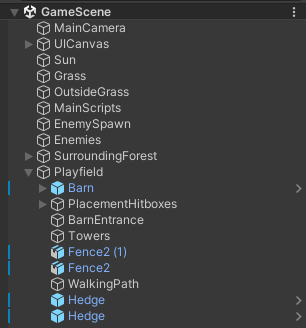
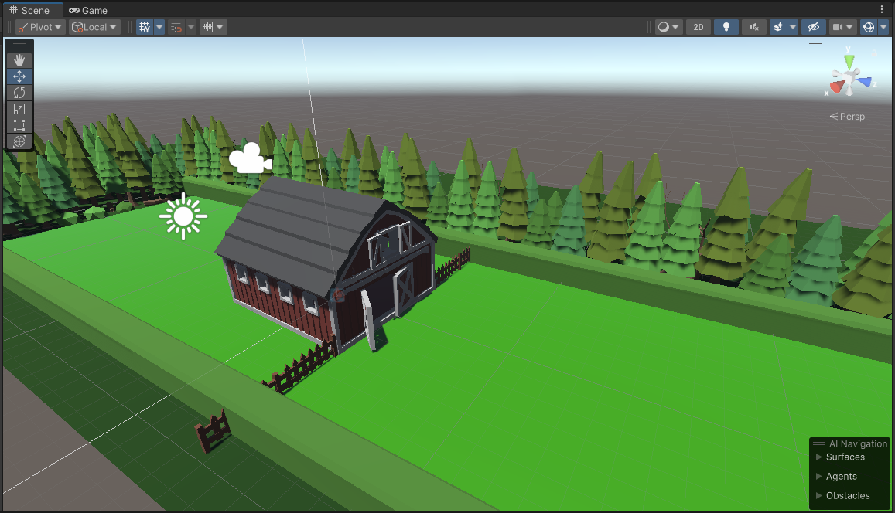
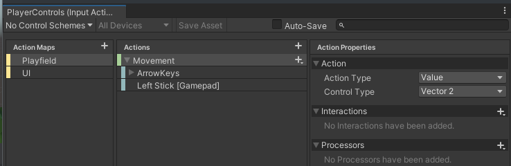
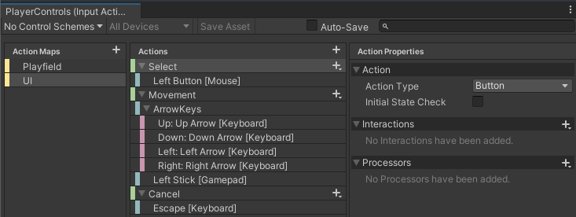
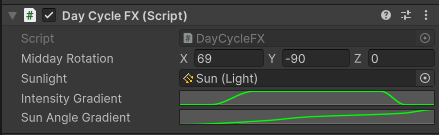
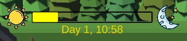

# First "Cow House Fights Back!" development update!
Having completed the first milestone - "Basic skeleton & base assets", it would be a great time to go over what and how it was implemented!

## In search of assets
While the main direction of game's artstyle was set in GDD, finding the exact assets that match the style can be difficult. To search for assets, I mainly used [Unity's Asset Store](https://assetstore.unity.com/), from which I got:
* Some [low-poly animals](https://assetstore.unity.com/packages/3d/characters/animals/animals-free-low-poly-asset-pack-by-ithappy-260727)
* And [vegetation](https://assetstore.unity.com/packages/3d/vegetation/nature-pack-low-poly-trees-bushes-210184)

I also used [itch.io](https://itch.io/game-assets) to get the barn, the chicken house and other wildlife animals.
* [Farm buildings](https://quaternius.itch.io/lowpoly-farm-buildings) by quaternius
* Free [wildlife animals](https://free-game-assets.itch.io/free-wild-animal-3d-low-poly-models)
 

## Creating a test map
For testing purposes I had to create a simple map in which I could also test placing down towers, wildlife attacks and animal farming. The end result was this: 

* <b>Main camera</b> used to control player's camera
* <b>Sun</b> - <i>Directional</i> light source, which rotates around itself to create a nice daylight effect
* <b>Grass</b> - the bright green area, where player will be able to place towers and farm buildings. Marked as <i>PlacementArea</i> layer to easily distinguish from other things.
* <b>MainScripts</b> - used to hold scripts that control the game flow, for example the <i>GameController</i> script
* <b>EnemySpawn</b> - used to mark the area where enemies spawn, as well as hold the <i>EnemySpawner</i> script.
* <b>Enemies</b> - an empty <i>GameObject</i>, which gets populated with spawned enemies
* <b>Playfield</b> - a <i>GameObject</i> that holds objects related to tower and enemy interactions. It also holds <i>NavMesh</i> data used for enemy pathfinding. <b>Towers</b> is an empty <i>GameObject</i> to hold placed down towers, but <b>BarnEntrance</b> is the enemy target destination.

## Controls & Camera movement
Implementing camera movement was quite simple - I followed a [tutorial](https://www.youtube.com/watch?v=HmXU4dZbaMw) to understand how to register input in Unity. I chose to create a single <i>InputActionAsset</i> to register player input. Then I initialized and listened to it within the <b>Main Camera</b>'s <i>CameraController</i> script. The input allows joystick and arrow keys to move the camera to left (-X) and right (+X). 

## Day/Night cycle
Getting the cycle to feel right was quite difficult, but I used <i>AnimationCurve</i> to create a gradient for the light <b>intensity</b> and rotation of the sun for shadows. At first I used regular <i>Gradient</i> using the <b>Alpha channel</b> and blending to create the smooth animation, but after seeing a [video](https://www.youtube.com/watch?v=Nc9x0LfvJhI&t=394s) about animation curves, they were just what I needed.

## Spawning enemies
The <b>GameController</b> script keeps track of current day and time and invokes a `public static` time change `event Action`, which gets picked up by the <b>EnemySpawner</b> script and checks if enough time has been passed to spawn a new enemy.

## Placing down towers
Placing down the towers required setting up the <b>Grass</b> to be a placable area (PlacementArea layer), as well as creating some invisible boundaries (Placement layer) using colliders. Whenever a <i>placable</i> object is attempted to be placed, it via <i>Ray</i> whether the mouse hits <b>PlacementArea</b> layer and the object is not colliding with the <b>Placement</b> layer.

## Basic UI
For now the UI only contains the day/night cycle bar. It is a part of <b>UICanvas</b> in Overlay mode. Just like <b>EnemySpawner</b>, it also listens to time change and updates the day and time accordingly, as well as uses a <i>Gradient</i> to determine the color of the bar. This [healthbar tutorial](https://www.youtube.com/watch?v=BLfNP4Sc_iA) helped me also understand some concepts behind progress bars. 
